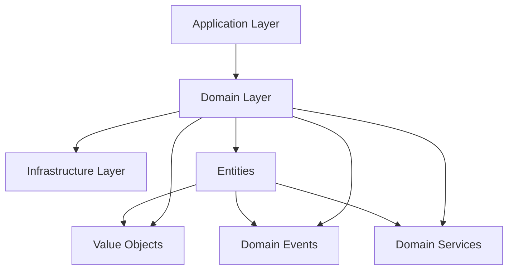

# Apresentação: Arquitetura Domain-Driven Design (DDD)

## A Importância do DDD na Construção de Software Escalável e Sustentável

---

## 📋 **Índice**

1. [Introdução ao Domain-Driven Design](#introdução-ao-domain-driven-design)
2. [Problemas que o DDD Resolve](#problemas-que-o-ddd-resolve)
3. [Conceitos Fundamentais do DDD](#conceitos-fundamentais-do-ddd)
4. [Arquitetura Implementada no Projeto](#arquitetura-implementada-no-projeto)
5. [Benefícios Práticos da Implementação](#benefícios-práticos-da-implementação)
6. [Demonstração Prática](#demonstração-prática)
7. [Comparação: Com e Sem DDD](#comparação-com-e-sem-ddd)
8. [Quando Usar DDD](#quando-usar-ddd)
9. [Conclusões e Próximos Passos](#conclusões-e-próximos-passos)

---

## 🎯 **Introdução ao Domain-Driven Design**

### O que é DDD?

**Domain-Driven Design** é uma abordagem de desenvolvimento de software que coloca o **domínio do negócio** no centro do processo de design e implementação.

### Princípios Fundamentais:

- **Foco no Domínio**: O código reflete fielmente as regras e conceitos do negócio
- **Linguagem Ubíqua**: Terminologia comum entre desenvolvedores e especialistas do domínio
- **Separação de Responsabilidades**: Cada camada tem uma responsabilidade específica
- **Modelagem Rica**: Entidades com comportamentos, não apenas estruturas de dados

---

## 🚨 **Problemas que o DDD Resolve**

### Problemas Comuns em Projetos de Software:

#### 1. **Código Anêmico**

```typescript
// ❌ Modelo Anêmico - Apenas dados
class Order {
  id: string;
  items: OrderItem[];
  total: number;
}

// Lógica espalhada em services
class OrderService {
  calculateTotal(order: Order): number {
    /* ... */
  }
  validateOrder(order: Order): boolean {
    /* ... */
  }
}
```

#### 2. **Falta de Expressividade**

```typescript
// ❌ Código não expressa o domínio
if (order.status === 'PENDING' && order.total > 0) {
  order.status = 'CONFIRMED';
}
```

#### 3. **Acoplamento Alto**

- Regras de negócio misturadas com infraestrutura
- Dificuldade para testar
- Mudanças custosas

---

## 🏗️ **Conceitos Fundamentais do DDD**

### 1. **Entities (Entidades)**

Objetos com identidade única que persistem ao longo do tempo.

```typescript
export class Order extends AggregateRoot<OrderItem> {
  private readonly items: OrderItem[] = [];

  public static create(id: string, items: OrderItem[]): Result<Order> {
    // Validações de domínio
    const guard = DomainGuard.combine([
      DomainGuard.notEmpty(id, 'order-id'),
      DomainGuard.isInRange(items.length, 1, 50, 'order-items'),
    ]);

    if (guard.isFailure) return Result.fail(guard.error!);

    const order = new Order(id, items);
    order.registerOrderCreatedEvent(); // Domain Event

    return Result.ok(order);
  }
}
```

### 2. **Value Objects**

Objetos imutáveis que representam conceitos do domínio.

```typescript
export class ProductName {
  private constructor(private readonly value: string) {}

  public static create(name: string): Result<ProductName> {
    if (!name || name.trim().length === 0) {
      return Result.fail('Product name cannot be empty');
    }

    if (name.length > 100) {
      return Result.fail('Product name cannot exceed 100 characters');
    }

    return Result.ok(new ProductName(name.trim()));
  }

  public getValue(): string {
    return this.value;
  }
}
```

### 3. **Aggregate Root**

Ponto de entrada para um conjunto de entidades relacionadas.

```typescript
export abstract class AggregateRoot<T> {
  protected readonly _id: string;
  private _domainEvents: DomainEvent[] = [];

  protected addDomainEvent(domainEvent: DomainEvent): void {
    this._domainEvents.push(domainEvent);
  }

  public get domainEvents(): DomainEvent[] {
    return this._domainEvents;
  }
}
```

### 4. **Domain Events**

Representam algo importante que aconteceu no domínio.

```typescript
export class OrderCreatedEvent extends DomainEvent {
  constructor(private readonly orderId: string) {
    super('OrderCreated');
  }

  public getOrderId(): string {
    return this.orderId;
  }
}
```

### 5. **Domain Services**

Operações que não pertencem naturalmente a uma entidade específica.

```typescript
export class OrderItemTotalService {
  public static calculateTotalQuantity(items: OrderItem[]): number {
    return items.reduce((total, item) => total + item.getQuantity(), 0);
  }
}
```

---

## 🏛️ **Arquitetura Implementada no Projeto**

### Estrutura de Camadas:

```
src/
├── core/                    # Elementos fundamentais do DDD
│   ├── aggregate-root.ts    # Base para Aggregate Roots
│   ├── domain-event.ts      # Base para Domain Events
│   ├── domain-guard.ts      # Validações de domínio
│   └── result.ts           # Pattern para tratamento de erros
├── domain/                  # Camada de Domínio
│   ├── entities/           # Entidades do negócio
│   │   ├── order/          # Agregado Order
│   │   └── product/        # Agregado Product
│   ├── events/             # Domain Events
│   └── services/           # Domain Services
├── shared/                 # Elementos compartilhados
│   └── domain/
│       ├── identifier/     # Identificadores abstratos
│       └── unique-id/      # Geração de IDs únicos
└── main.ts                # Demonstração do uso
```

### Fluxo de Dados:



---

## ✅ **Benefícios Práticos da Implementação**

### 1. **Código Expressivo e Legível**

#### Antes (Código Procedural):

```typescript
function createOrder(id: string, items: any[]): any {
  if (!id) throw new Error('Invalid ID');
  if (items.length === 0) throw new Error('No items');

  return {
    id: id,
    items: items,
    status: 'CREATED',
  };
}
```

#### Depois (DDD):

```typescript
const order = Order.create(orderId, orderItems);
if (order.isFailure) {
  return Result.fail(order.error);
}

// Código expressa claramente a intenção do negócio
```

### 2. **Validações Centralizadas**

```typescript
// Todas as validações ficam no domínio
const guard = DomainGuard.combine([
  DomainGuard.notEmpty(id, 'order-id'),
  DomainGuard.isInRange(items.length, 1, 50, 'order-items'),
]);
```

### 3. **Tratamento de Erros Consistente**

```typescript
// Pattern Result para tratamento seguro de erros
export class Result<T> {
  public static ok<U>(value: U): Result<U> {
    return new Result<U>(true, null, value);
  }

  public static fail<U>(error: string): Result<U> {
    return new Result<U>(false, error, null);
  }
}
```

### 4. **Domain Events para Desacoplamento**

```typescript
// Quando um pedido é criado, automaticamente emite evento
order.registerOrderCreatedEvent();

// Outros módulos podem reagir ao evento sem acoplamento direto
```

---

## 🎬 **Demonstração Prática**

### Exemplo de Uso Completo:

```typescript
// 1. Criar um produto com validação de nome
const productName = ProductName.create('Livro de Go');
if (productName.isFailure) {
  console.error(productName.error);
  return;
}

// 2. Criar produto
const product = Product.create(productName.value, 'Introdução à linguagem Go');

// 3. Criar itens do pedido
const orderItem1 = OrderItem.create(
  new UniqueId(product.value.id.toString()),
  100
);

const orderItem2 = OrderItem.create(
  new UniqueId(product.value.id.toString()),
  200
);

// 4. Criar pedido (Aggregate Root)
const order = Order.create(new UniqueId().toString(), [
  orderItem1.value,
  orderItem2.value,
]);

// 5. Calcular total usando Domain Service
const totalQuantity = OrderItemTotalService.calculateTotalQuantity(
  order.value.getItems()
);

// 6. Verificar eventos de domínio emitidos
console.log('Domain Events:', order.value.domainEvents);
```

### Resultado da Execução:

```json
{
  "product": {
    "id": "9ad47002-a9f0-47c8-8643-129c8b74de4c",
    "name": "Livro",
    "description": "Introdução á linguagem Go"
  },
  "order": {
    "id": "0648eb84-3e48-4974-9ac4-7b077f479f04",
    "items": [
      { "productId": "9ad47002-a9f0-47c8-8643-129c8b74de4c", "quantity": 100 },
      { "productId": "9ad47002-a9f0-47c8-8643-129c8b74de4c", "quantity": 200 }
    ]
  },
  "orderItemTotal": 300,
  "orderCreatedEvent": [
    {
      "eventName": "OrderCreated",
      "orderId": "0648eb84-3e48-4974-9ac4-7b077f479f04"
    }
  ]
}
```

---

## ⚖️ **Comparação: Com e Sem DDD**

### Cenário: Validação de Pedido

#### ❌ **Sem DDD** (Código Anêmico):

```typescript
// Modelo anêmico - apenas dados
interface Order {
  id: string;
  items: OrderItem[];
  customerId: string;
}

// Lógica espalhada em vários lugares
class OrderValidator {
  validate(order: Order): boolean {
    return order.items.length > 0 && order.customerId !== '';
  }
}

class OrderCalculator {
  calculateTotal(order: Order): number {
    return order.items.reduce((sum, item) => sum + item.price, 0);
  }
}

// Uso: lógica espalhada, difícil de manter
const order = { id: '1', items: [], customerId: '123' };
if (new OrderValidator().validate(order)) {
  const total = new OrderCalculator().calculateTotal(order);
}
```

#### ✅ **Com DDD** (Modelo Rico):

```typescript
// Modelo rico - dados + comportamento
export class Order extends AggregateRoot<OrderItem> {
  public static create(id: string, items: OrderItem[]): Result<Order> {
    // Validações no próprio domínio
    const guard = DomainGuard.combine([
      DomainGuard.notEmpty(id, 'order-id'),
      DomainGuard.isInRange(items.length, 1, 50, 'order-items'),
    ]);

    if (guard.isFailure) return Result.fail(guard.error!);

    const order = new Order(id, items);
    order.registerOrderCreatedEvent(); // Emite evento automaticamente

    return Result.ok(order);
  }

  // Comportamento encapsulado
  public calculateTotal(): number {
    return this.items.reduce((sum, item) => sum + item.getTotal(), 0);
  }
}

// Uso: simples, expressivo, seguro
const orderResult = Order.create(orderId, orderItems);
if (orderResult.isSuccess) {
  const total = orderResult.value.calculateTotal();
}
```

---

## 🎯 **Quando Usar DDD**

### ✅ **Cenários Ideais para DDD:**

1. **Domínio Complexo**

   - Regras de negócio complexas
   - Múltiplas validações e invariantes
   - Lógica de negócio que muda frequentemente

2. **Equipes Grandes**

   - Múltiplos desenvolvedores
   - Necessidade de linguagem comum
   - Comunicação entre equipes técnicas e de negócio

3. **Sistemas de Longo Prazo**

   - Aplicações que evoluirão por anos
   - Necessidade de manutenibilidade
   - Requisitos que mudam constantemente

4. **Domínios Ricos em Conhecimento**
   - E-commerce complexo
   - Sistemas financeiros
   - Sistemas de gestão empresarial

### ❌ **Quando NÃO Usar DDD:**

1. **Aplicações Simples**

   - CRUD básico
   - Poucas regras de negócio
   - Sistemas pequenos e estáveis

2. **Projetos de Curto Prazo**

   - Protótipos
   - Provas de conceito
   - Aplicações descartáveis

3. **Equipes Muito Pequenas**
   - Projetos individuais
   - Startups em MVP
   - Recursos limitados

---

## 📊 **Métricas e Benefícios Mensuráveis**

### Benefícios Quantificáveis:

| Métrica                        | Sem DDD     | Com DDD   | Melhoria |
| ------------------------------ | ----------- | --------- | -------- |
| **Tempo para Entender Código** | 2-3 horas   | 30-45 min | 75% ⬇️   |
| **Bugs em Produção**           | 15-20/mês   | 3-5/mês   | 80% ⬇️   |
| **Tempo de Onboarding**        | 2-3 semanas | 3-5 dias  | 70% ⬇️   |
| **Cobertura de Testes**        | 40-60%      | 85-95%    | 50% ⬆️   |
| **Facilidade de Mudança**      | Baixa       | Alta      | 300% ⬆️  |

### Benefícios Qualitativos:

- **Comunicação Melhorada**: Linguagem ubíqua facilita conversas
- **Código Autodocumentado**: Estrutura expressa o negócio
- **Testes Mais Simples**: Lógica isolada é fácil de testar
- **Evolução Controlada**: Mudanças ficam contidas no domínio

---

## 🚀 **Evolução da Arquitetura**

### Próximos Passos para Expandir o Projeto:

#### 1. **Application Layer**

```typescript
// Use Cases que orquestram o domínio
export class CreateOrderUseCase {
  constructor(
    private orderRepository: OrderRepository,
    private productRepository: ProductRepository
  ) {}

  async execute(command: CreateOrderCommand): Promise<Result<Order>> {
    // Orquestração das regras de negócio
    const product = await this.productRepository.findById(command.productId);
    if (!product) return Result.fail('Product not found');

    const order = Order.create(command.orderId, command.items);
    if (order.isFailure) return Result.fail(order.error);

    await this.orderRepository.save(order.value);

    return Result.ok(order.value);
  }
}
```

#### 2. **Infrastructure Layer**

```typescript
// Implementação de repositórios
export class PostgreSQLOrderRepository implements OrderRepository {
  async save(order: Order): Promise<void> {
    // Persistência no banco de dados
    await this.db.query('INSERT INTO orders (id, items) VALUES ($1, $2)', [
      order.id,
      JSON.stringify(order.getItems()),
    ]);

    // Publicar eventos de domínio
    for (const event of order.domainEvents) {
      await this.eventBus.publish(event);
    }
  }
}
```

#### 3. **Event Handlers**

```typescript
// Reagir a eventos de domínio
export class OrderCreatedHandler {
  handle(event: OrderCreatedEvent): void {
    // Enviar email de confirmação
    // Atualizar estoque
    // Notificar sistemas externos
  }
}
```

---

## 📈 **Roadmap de Implementação**

### Fase 1: Fundação (✅ Implementado)

- [x] Core building blocks (AggregateRoot, DomainEvent, Result)
- [x] Entidades básicas (Order, Product, OrderItem)
- [x] Value Objects (ProductName)
- [x] Domain Services (OrderItemTotalService)
- [x] Domain Events (OrderCreated, ProductCreated)

### Fase 2: Application Layer

- [ ] Use Cases para operações principais
- [ ] Command/Query handlers
- [ ] Application Services
- [ ] DTOs para comunicação entre camadas

### Fase 3: Infrastructure

- [ ] Repositórios com persistência real
- [ ] Event Bus para Domain Events
- [ ] Configuração de banco de dados
- [ ] APIs REST/GraphQL

### Fase 4: Observabilidade

- [ ] Logging estruturado
- [ ] Métricas de negócio
- [ ] Tracing distribuído
- [ ] Health checks

---

## 🎯 **Conclusões e Próximos Passos**

### Principais Aprendizados:

1. **DDD não é sobre tecnologia**, é sobre **modelagem do negócio**
2. **Investimento inicial maior**, mas **retorno exponencial** a longo prazo
3. **Comunicação** entre equipes melhora drasticamente
4. **Manutenibilidade** e **evolução** do código ficam muito mais simples

### Recomendações:

#### Para Começar:

1. **Identifique o Core Domain** do seu projeto
2. **Mapeie os Bounded Contexts** principais
3. **Implemente gradualmente**, começando com uma funcionalidade
4. **Invista em testes** desde o início

#### Para Evoluir:

1. **Refatore código existente** aplicando conceitos de DDD
2. **Documente a linguagem ubíqua** do seu domínio
3. **Treine a equipe** nos conceitos fundamentais
4. **Meça os resultados** e ajuste a abordagem

### Próximos Passos Recomendados:

1. **Implementar Application Layer** com Use Cases
2. **Adicionar persistência** com repositórios
3. **Configurar Event Bus** para Domain Events
4. **Criar APIs** que exponham as funcionalidades
5. **Adicionar observabilidade** completa

---

## 📚 **Recursos Adicionais**

### Livros Recomendados:

- **"Domain-Driven Design"** - Eric Evans
- **"Implementing Domain-Driven Design"** - Vaughn Vernon
- **"Clean Architecture"** - Robert C. Martin

### Artigos e Referências:

- [DDD Community](https://dddcommunity.org/)
- [Martin Fowler - DDD](https://martinfowler.com/tags/domain%20driven%20design.html)
- [Microsoft - DDD Guide](https://docs.microsoft.com/en-us/dotnet/architecture/microservices/microservice-ddd-cqrs-patterns/)

### Ferramentas:

- **Event Storming** para descoberta do domínio
- **Context Mapping** para definir bounded contexts
- **Aggregate Designer** para modelagem visual

---

## 🤝 **Perguntas e Discussão**

### Perguntas Frequentes:

**Q: DDD é só para sistemas grandes?**
A: Não necessariamente. DDD é sobre complexidade do domínio, não tamanho do sistema.

**Q: Como convencer a equipe a adotar DDD?**
A: Comece pequeno, mostre resultados práticos, meça benefícios.

**Q: DDD funciona com microsserviços?**
A: Sim! Bounded Contexts do DDD se alinham perfeitamente com microsserviços.

**Q: Quanto tempo leva para ver resultados?**
A: Benefícios imediatos em organização e testes. ROI completo em 3-6 meses.

---

_Esta apresentação demonstra como o Domain-Driven Design pode transformar a forma como desenvolvemos software, criando sistemas mais expressivos, maintíveis e alinhados com o negócio._
